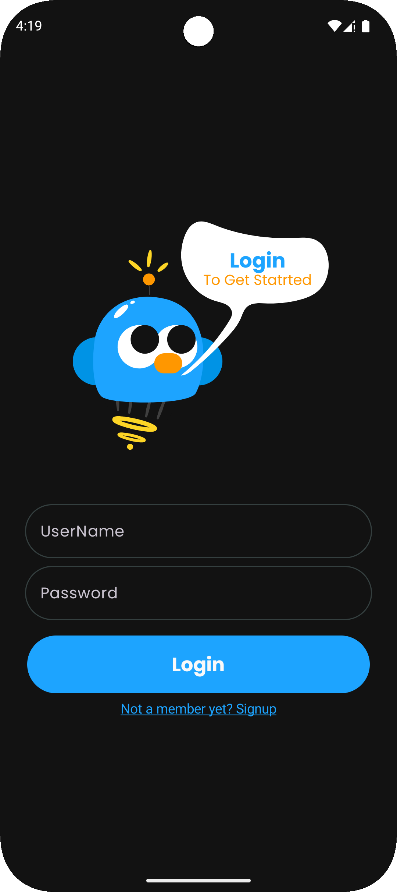
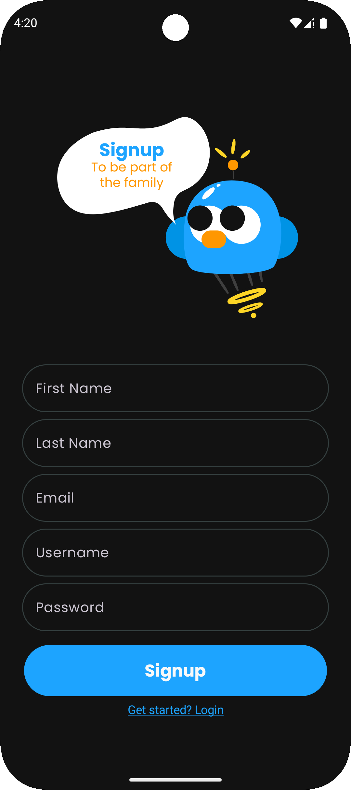
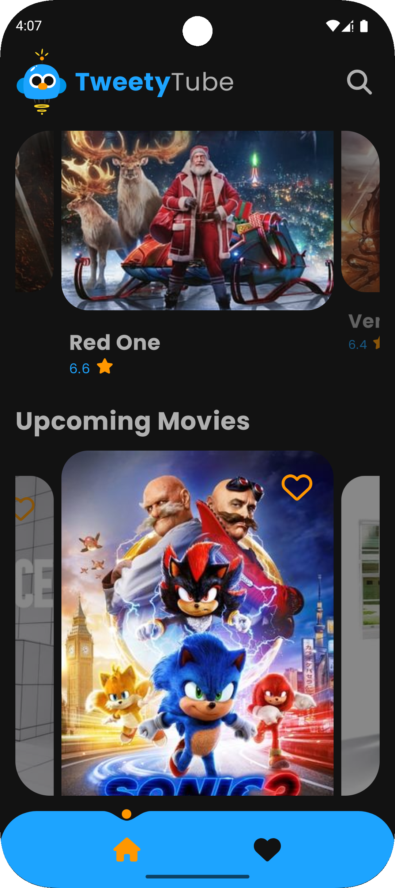
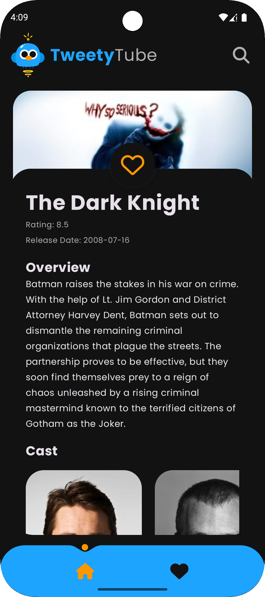
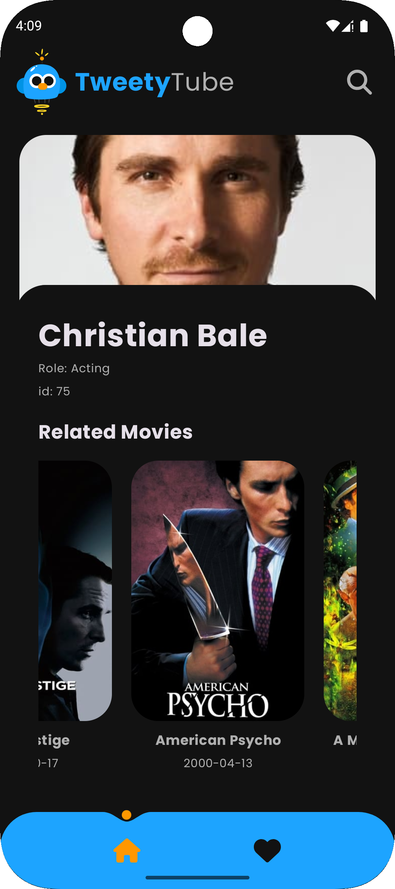
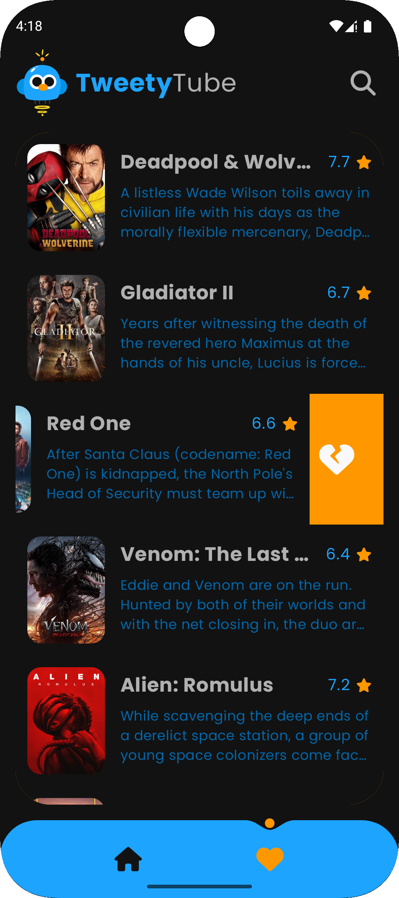
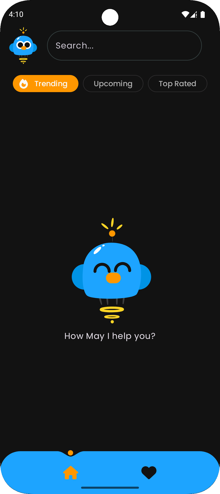
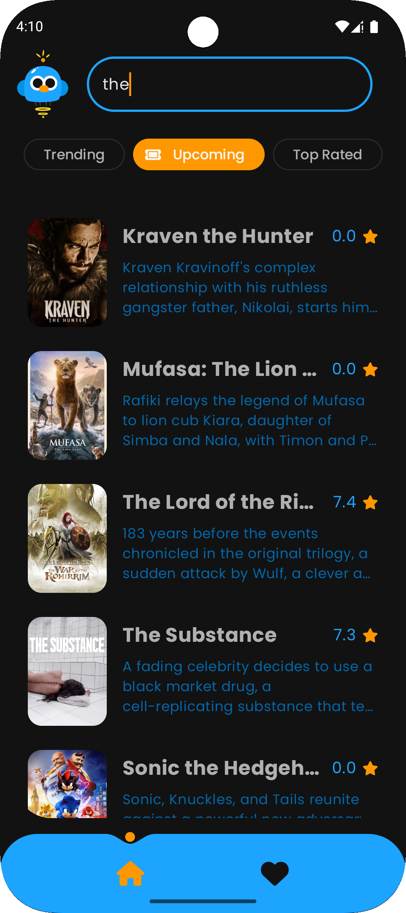
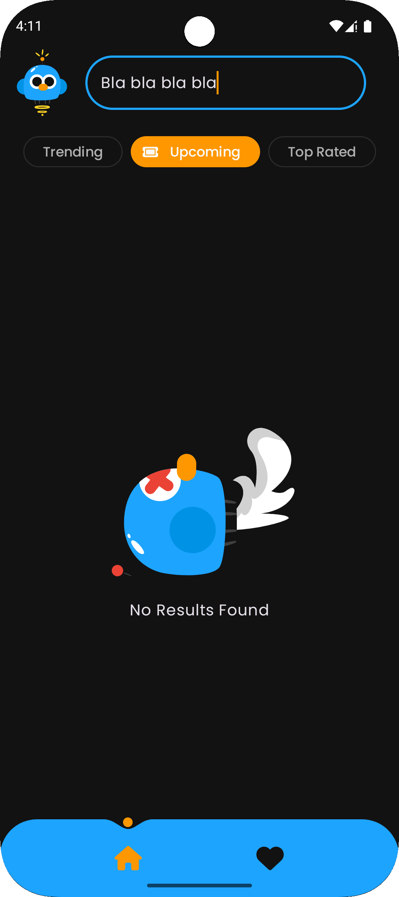

  

# Tweety Tube

Tweety Tube is an Android movie streaming application built using Kotlin, Jetpack Compose, and the
MVVM architectural pattern. It provides users with a seamless experience to browse, search, and
discover movies, with a clean and modern UI design. This project was developed as part of a 3-month
internship at Atos Egypt.

## Features

- **Home Screen**: Displays a collection of movies categorized into rows.
- **Movie Details**: View detailed information about any movie, including its title, description,
  cast, and more.
- **Actor Detail Screen**: Explore detailed information about actors, including a list of related
  movies.
- **Bottom Navigation Bar**: Easy navigation between different app sections.
- **Category Management**: Efficiently organize and manage favorite items with ease.
- **User Authentication**: Secure login and signup to ensure data protection.
- **Search Functionality**: Quickly locate content with a responsive search system.
- **Customizable Filters**: Refine searches and results using filtering options.
- **Dark Mode**: Light and dark themes for optimal user experience.
- **Offline Mode**: Access critical features and data without an active internet connection.
- **MVVM + Clean Architecture**: To ensure scalability, testability, and maintainability.
- **Voice Command Search (Beta)**: Voice-enabled search functionality.

## Integration

- The application utilizes data from The Movie Database (TMDb) API for movies, cast details, and
  related content, implemented with the help of the integration team.

  
  
  
  
  
  
  
  
  

